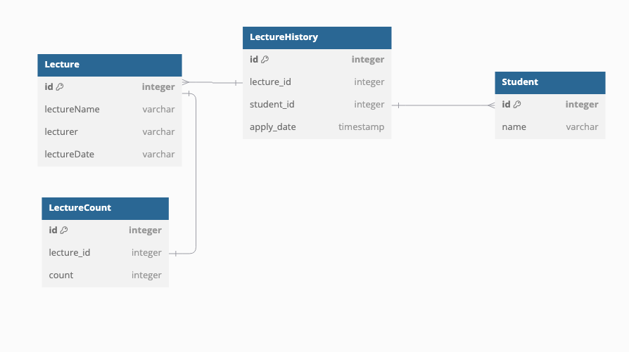

# ERD

## 테이블 항목

### 특강(lecture)

- id
- 강연 이름
- 강연자 이름
- 강연 날짜

### 학생(student)

- id
- 학생 이름

### 특강 신청 이력(lecture_history)

- id
- 특강 id
- 학생 id
- 신청일자

유니크 (특강 id, 학생 id)

### 특강신청인원(lecture_count)

- id
- 특강 id
- 신청인원

## 테이블 설계 이유

특강이 날짜별로 존재하고 이를 나타내기 위한 테이블이 필요했고
특강을 신청하는 대상인 학생이 필요했습니다.

요구사항에 존재하는 `특강 신청 완료 목록 조회 API`를 구현하기 위해 학생이 특강을 신청한 이력을 저장하는 테이블이 필요했습니다.
그러기 위해 lecture_history 테이블을 생성하였습니다.

마지막으로 `특강은 선착순 30명만 신청 가능합니다.` 요구 사항이 있었는데

1. lecture_history테이블을 Counting 하는 방법
2. lecture_count 테이블을 생성하여 신청인원을 저장하는 방법
3. lecture 테이블에 신청인원을 저장하는 방법

중 하나를 선택해야 했고 lecture_count 테이블을 생성하게 된 이유는 추후 동시성 제어 테스트를 진행 할 때
lecture_count 테이블을 이용하여 동시성 제어를 진행할 때 얼마나 많은 요청이 카운팅 되는지 확인 하고 싶었습니다.

# DataBase Lock

## Lock

- 위의 필수조건을 만족하면서 동시성 이슈를 고려하여 Lock을 사용하여 해결
- DataBase의 Lock 사용
    - READ : 읽기 작업을 수행할 때 사용
    - WRITE : 쓰기 작업을 수행할 때 사용
    - OPTIMISTIC : 낙관적 락을 사용할 때 사용
    - OPTIMISTIC_FORCE_INCREMENT : 낙관적 락을 사용할 때 사용하며, 엔티티의 버전을 강제로 증가시킬 때 사용
    - PESSIMISTIC_READ : 비관적 락을 사용할 때 사용하며, 읽기 작업을 수행할 때 사용
    - PESSIMISTIC_WRITE : 비관적 락을 사용할 때 사용하며, 쓰기 작업을 수행할 때 사용
    - PESSIMISTIC_FORCE_INCREMENT : 비관적 락을 사용할 때 사용하며, 엔티티의 버전을 강제로 증가시킬 때 사용
    - NONE : 락을 사용하지 않을 때 사용 ( default )

### 비관적락? 낙관적락?

#### 비관적락(Pessimistic Locking)

- DataBase의 Transaction이 시작될 때 Shared Lock, Exclusive Lock을 사용하여 다른 Transaction이 접근하지 못하게 하는 방식
- Transaction이 끝날 때까지 Lock을 유지 다른 작업들은 Lock이 해제될 때까지 대기
- 데이터의 일관성을 보장 ( 데이터를 읽는 동안 다른 트랜잭션이 해당 데이터 변경 할 수 없음 )
- 성능이 낮고 Deadlock 발생 가능성이 높다

#### 낙관적락 (Optimistic Locking)

- 데이터를 읽을 때 락을 걸지 않고 데이터를 업데이트 할 때 이전 데이터와 현재 데이터를 비교하여 충돌 여부를 판단
- 주요 장점으로 읽는 동안 다른 Transaction이 데이터를 변경할 수 있으며, 데이터 충돌이 발생하면 Rollback을 통해 해결
- 성능이 좋고 Dedalock 발생 가능성이 낮다

## 진행하며 겪은 문제점

`SpringBootTest` 어노테이션 사용시 테스트 코드에서 @Transactional 사용하게 되면 Rollback 해주는 것으로 알고있는데
멀티스레드 환경에서 executorService 사용시 별도의 스레도르 트랜잭션을 공유하지 않아 동작하지 않는 이슈가 존재

### 해결방안

`afterEach` 를 이용하여 데이터를 삭제하는 방법 사용
